# PPS-U3-RA3 – Errores de seguridad por componentes vulnerables - IzanCD

## 1. Iniciar entorno de pruebas

1. Situarte en la carpeta del entorno de pruebas LAMP (la que contiene los scripts y el `docker-compose.yml`).
2. Restaurar la configuración original del escenario:
   ```bash
   sudo ./restaurarConfiguracionOriginal.sh
   ```
3. Levantar el escenario multicontenedor:
   ```bash
   docker-compose up -d
   ```

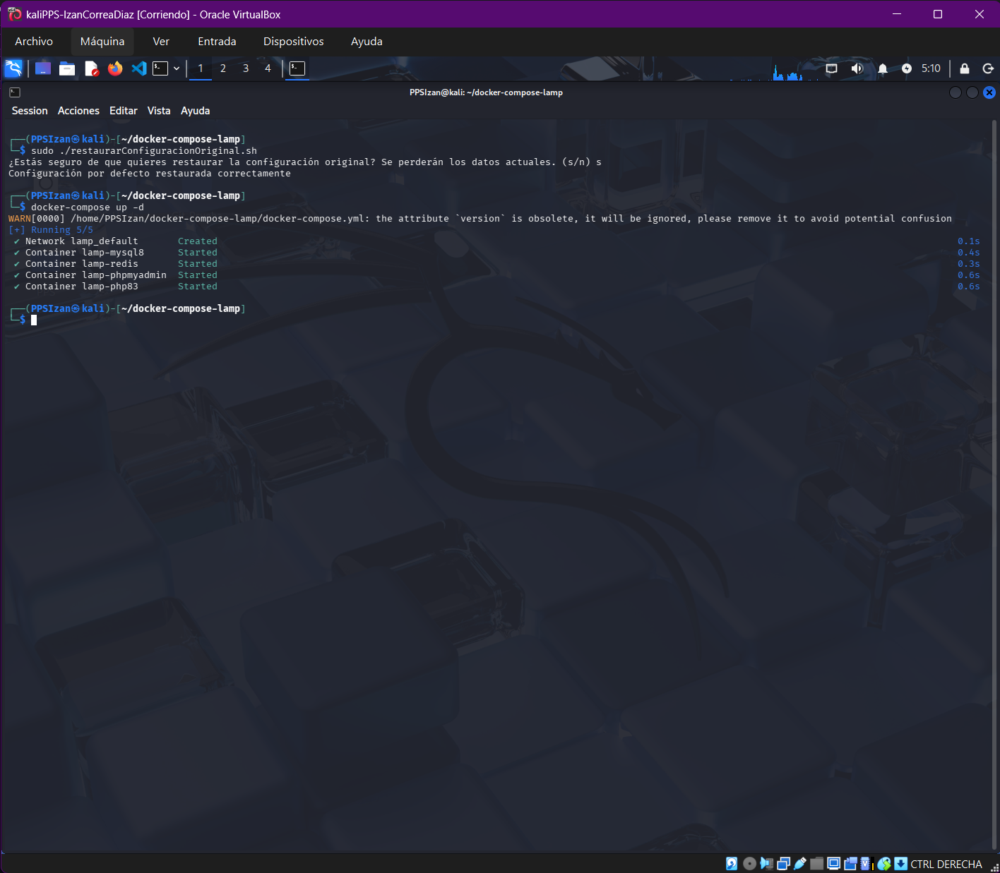
   
---

## 2. Apache en el escenario Docker

En este escenario utilizamos Docker Compose, así que para cambiar archivos de configuración:

- Si el archivo está en un volumen bind-mount (por ejemplo `./config`, `./logs`, `./config/vhosts`, `./config/php/php.ini`), lo editas desde tu máquina anfitriona.
- Si el archivo no está en bind-mount o prefieres cambiarlo dentro del contenedor, entra en el contenedor PHP/Apache:

```bash
docker exec -it lamp-php83 /bin/bash
```

El contenedor del servicio web se llama `lamp-php83`.
Si tu carpeta de proyecto no se llama `lamp`, el nombre del contenedor puede variar y tendrás que adaptarlo.

En una máquina Linux normal (sin docker-compose), Apache se instalaría con:

```bash
apt update
apt install apache2
```

Si no estás trabajando como `root`, añade `sudo` delante de los comandos.

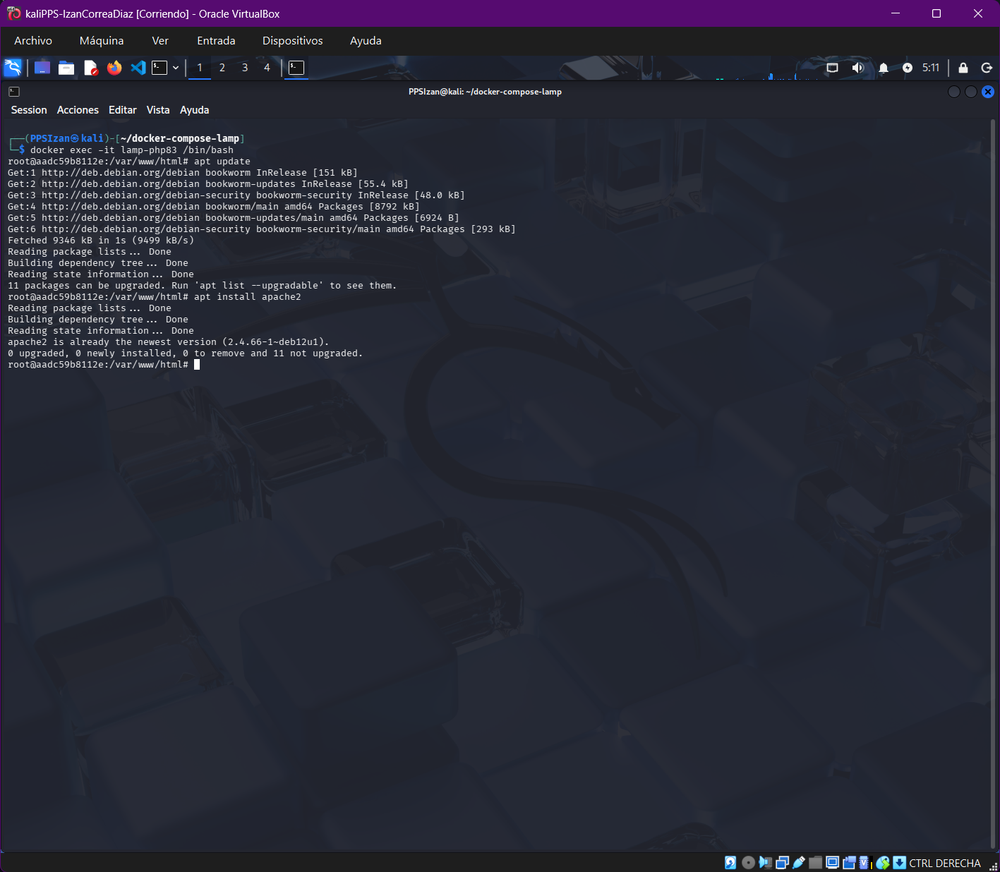

---

## 3. Estructura de directorios de Apache

El directorio principal de configuración de Apache es `/etc/apache2`.
Dentro encontrarás, entre otros, esta estructura:

```text
/etc/apache2/
|-- apache2.conf
|       `-- ports.conf
|-- mods-enabled
|       |-- *.load
|       `-- *.conf
|-- conf-enabled
|       `-- *.conf
`-- sites-enabled
        `-- *.conf
`-- sites-available
        `-- *.conf
```

Puntos clave:

- `apache2.conf` es el archivo de configuración global.
- Los **módulos** añaden funcionalidades a Apache (por ejemplo, `ssl` para HTTPS).
  - `mods-available`: módulos disponibles.
  - `mods-enabled`: módulos habilitados (activos).
- Listar módulos cargados:
  ```bash
  apache2ctl -t -D DUMP_MODULES
  ```

**Gestión de módulos:**

- Habilitar un módulo:
  ```bash
  a2enmod ssl
  ```

- Deshabilitar un módulo:
  ```bash
  a2dismod ssl
  ```

Internamente, `a2enmod` crea un enlace simbólico desde `mods-available` a `mods-enabled`; `a2dismod` elimina ese enlace.

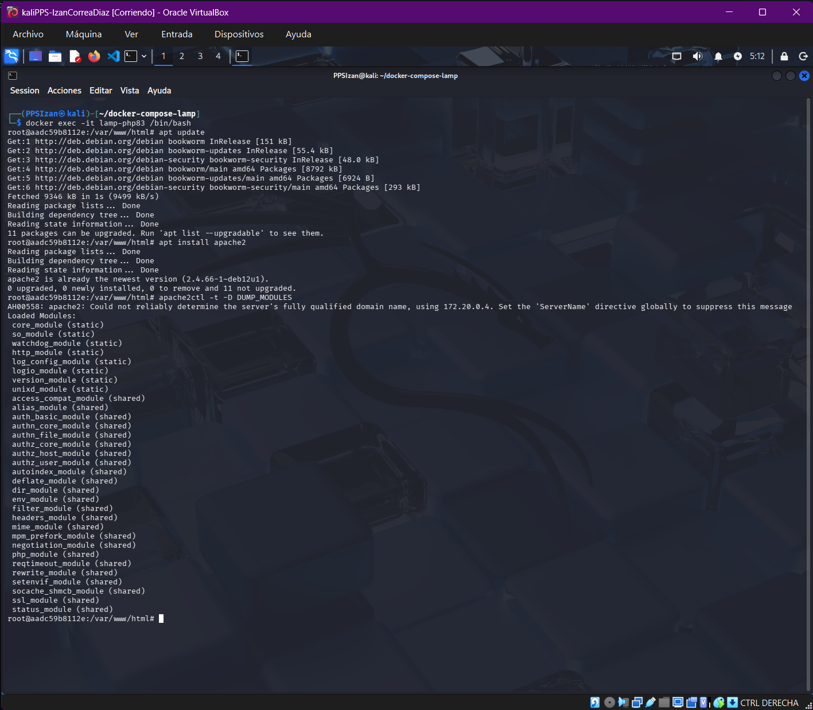

**Gestión de sitios virtuales:**

- `sites-available`: configuraciones de sitios disponibles (pueden estar habilitados o no).
- `sites-enabled`: configuraciones de sitios que Apache tiene activos.
- Habilitar un sitio:
  ```bash
  a2ensite archivo.conf
  ```
  
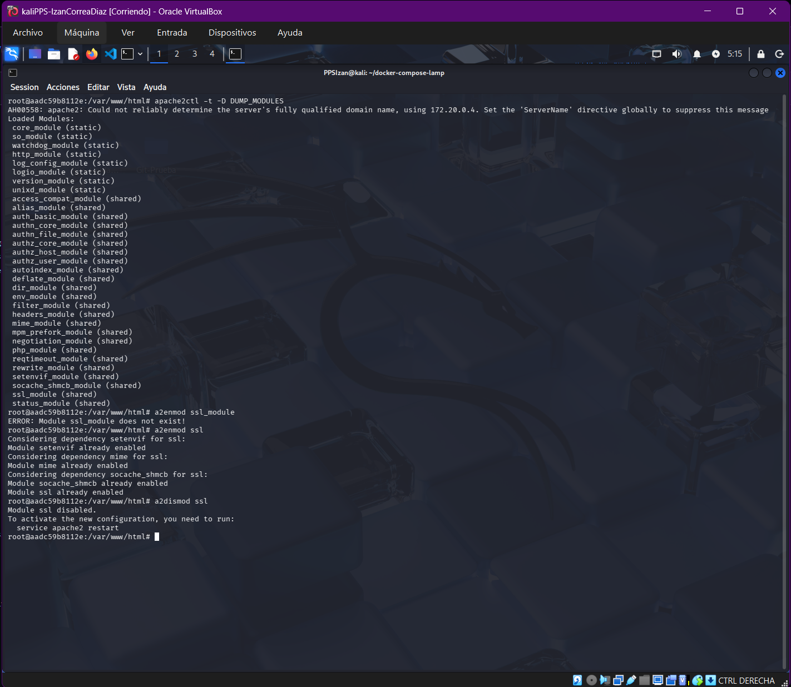

---

## 4. Creación de sitio virtual `www.pps.edu`

Para crear un sitio virtual modificamos un archivo en `sites-available`.
En este caso, vamos a usar `default.conf` (o un fichero equivalente) con este contenido:

```conf
<VirtualHost *:80>

    ServerName www.pps.edu
    ServerAdmin webmaster@localhost
    DocumentRoot /var/www/html

    ErrorLog ${APACHE_LOG_DIR}/error.log
    CustomLog ${APACHE_LOG_DIR}/access.log combined

</VirtualHost>
```

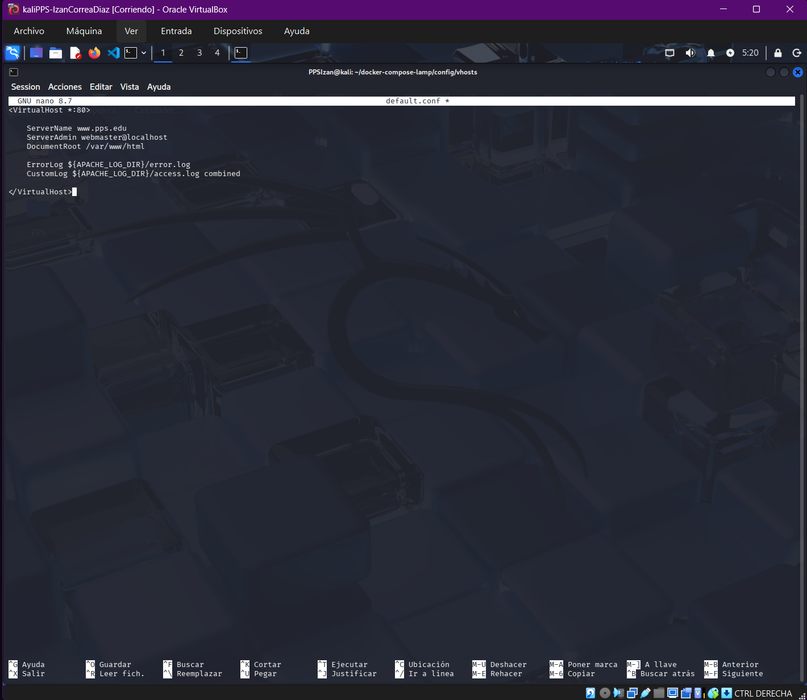

Significado de las directivas más importantes:

- `ServerName`: nombre del host virtual (en este caso `www.pps.edu`).
- `ServerAdmin`: correo del administrador del sitio.
- `DocumentRoot`: carpeta donde se sirven los archivos del sitio (`/var/www/html`).
- `ErrorLog` y `CustomLog`: rutas de los logs, usando la variable `${APACHE_LOG_DIR}` (en el contenedor es `/var/log/apache2`).

En tu pila LAMP los ficheros de vhosts están bind-mount en `./config/vhosts/`, así que normalmente basta con editar ahí y recargar Apache, sin usar `a2ensite`.
Si lo hicieras "a la antigua" desde dentro del contenedor:

```bash
docker exec lamp-php83 /bin/bash -c "service apache2 reload"
```

### Permisos y propietarios del DocumentRoot

Apache atiende las peticiones con el usuario y grupo `www-data`.
Para que tenga acceso al contenido del sitio en `/var/www/html`, puedes ejecutar:

```bash
docker exec lamp-php83 /bin/bash -c "chown -R www-data:www-data /var/www/html && chmod -R 755 /var/www/html"
```

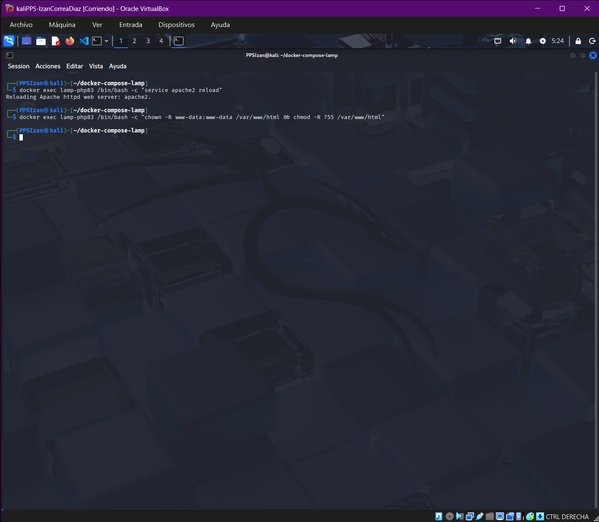

---

## 5. Resolución local de nombres: `/etc/hosts`

Tu navegador resuelve direcciones como `www.google.com` consultando servidores DNS que asocian el nombre con su IP.
Para los sitios virtuales locales que no están en DNS públicos, editas el archivo `/etc/hosts` en tu máquina anfitriona para asociar los nombres con IPs locales.

En el archivo `/etc/hosts` añades:

```
127.0.0.1 pps.edu www.pps.edu
```

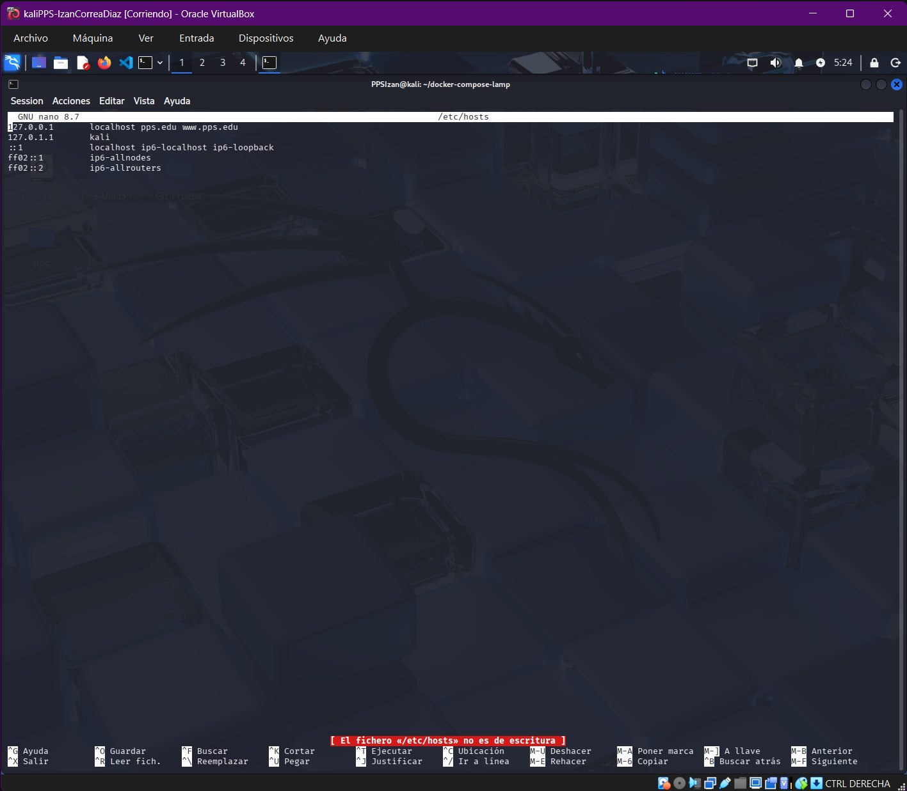

Como trabajamos con Docker y usamos redirección de puertos (el contenedor se expone en `http://localhost:80`), la IP `127.0.0.1` (bucle local) es perfecta.

Una vez añadida la línea en `/etc/hosts`, puedes acceder a:

```
http://www.pps.edu/
```

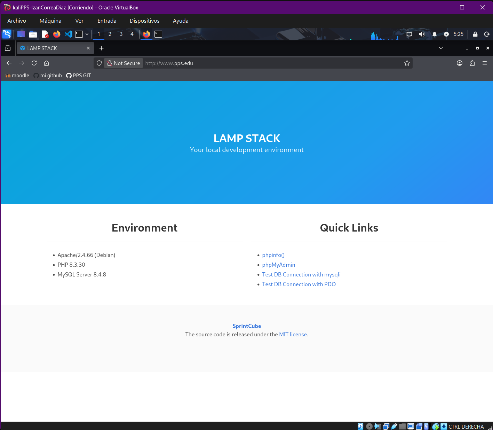

---

## 6. Creación de servidor virtual `www.hacker.edu`

Vamos a crear un segundo sitio virtual para alojar contenido de prueba (archivos "maliciosos" para simular vulnerabilidades).

Pasos:

1. Crear la estructura de directorios en el contenedor:
   ```bash
   docker exec -it lamp-php83 /bin/bash
   mkdir -p /var/www/hacker
   ```

2. Crear un archivo `index.html` básico en `/var/www/hacker/index.html`:
   ```html
   <html>
   <head><title>Hacker Site</title></head>
   <body>
   <h1>Welcome to Hacker Education Site</h1>
   <p>Este es un sitio de prueba para simulación de vulnerabilidades.</p>
   </body>
   </html>
   ```

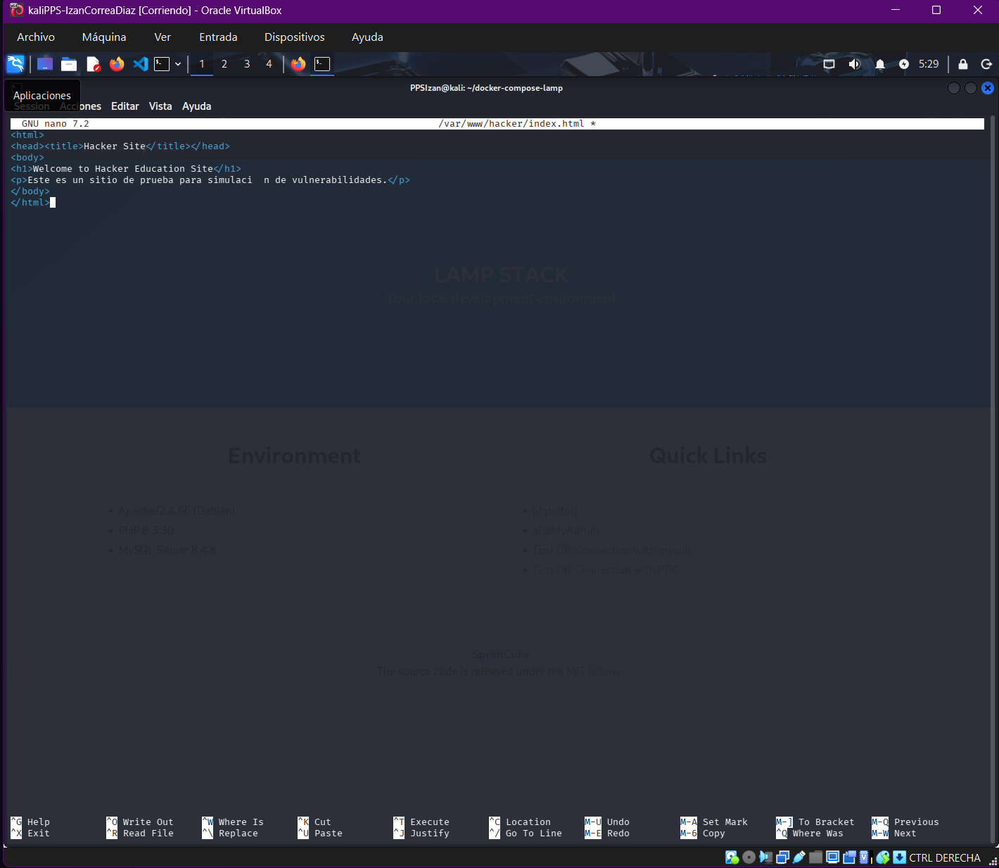

3. Establecer permisos y propietarios:
   ```bash
   chown -R www-data:www-data /var/www/hacker
   chmod -R 755 /var/www/hacker
   ```

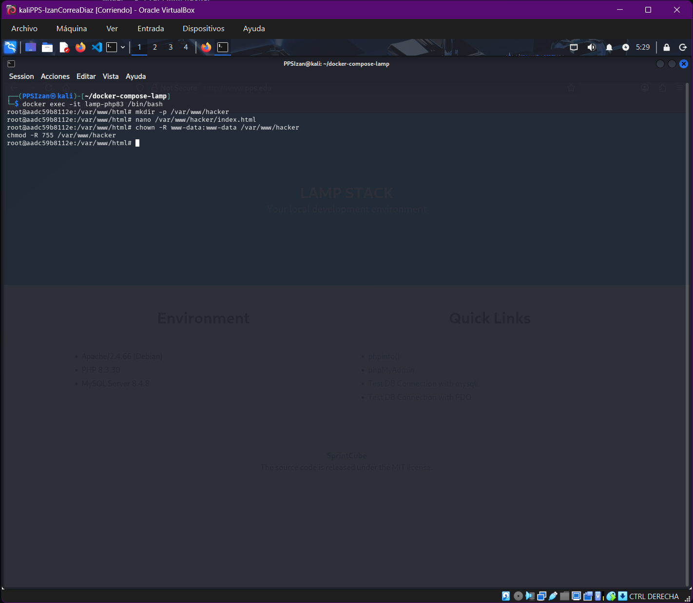

4. Crear el archivo de configuración del sitio virtual en `./config/vhosts/hacker.conf`:
   ```conf
   <VirtualHost *:80>
       ServerName www.hacker.edu
       ServerAdmin webmaster@localhost
       DocumentRoot /var/www/hacker

       ErrorLog ${APACHE_LOG_DIR}/error.log
       CustomLog ${APACHE_LOG_DIR}/access.log combined
   </VirtualHost>
   ```

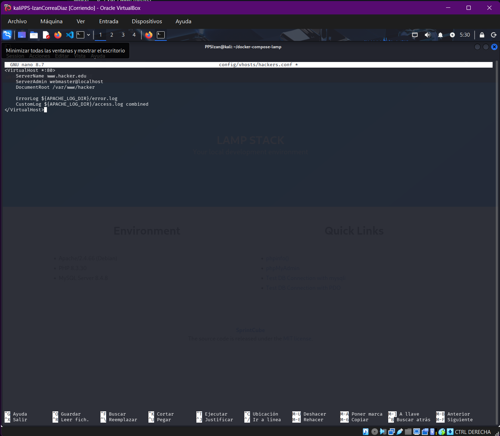

5. Recargar Apache:
   ```bash
   service apache2 reload
   ```

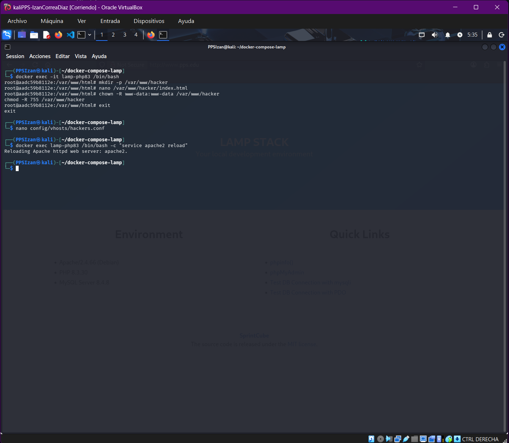

6. Añadir el dominio a `/etc/hosts` de tu anfitrón:
   ```
   127.0.0.1 hacker hacker.edu www.hacker.edu
   ```

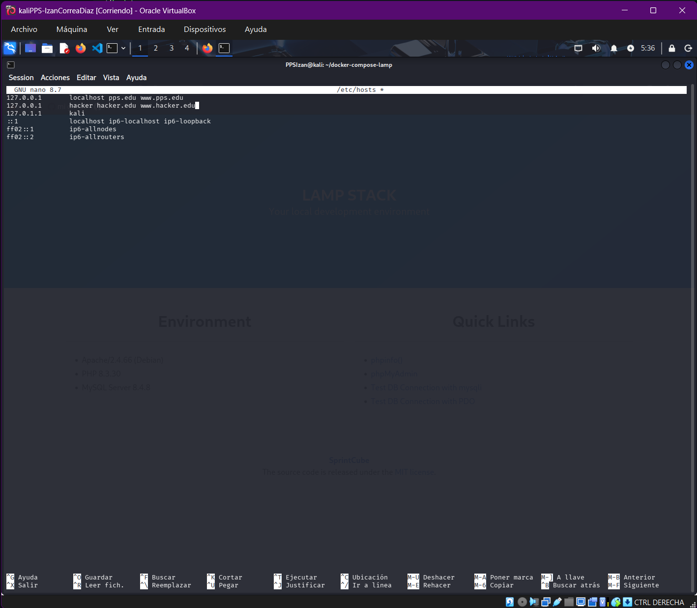

7. Acceder desde el navegador:
   ```
   http://www.hacker.edu/
   ```

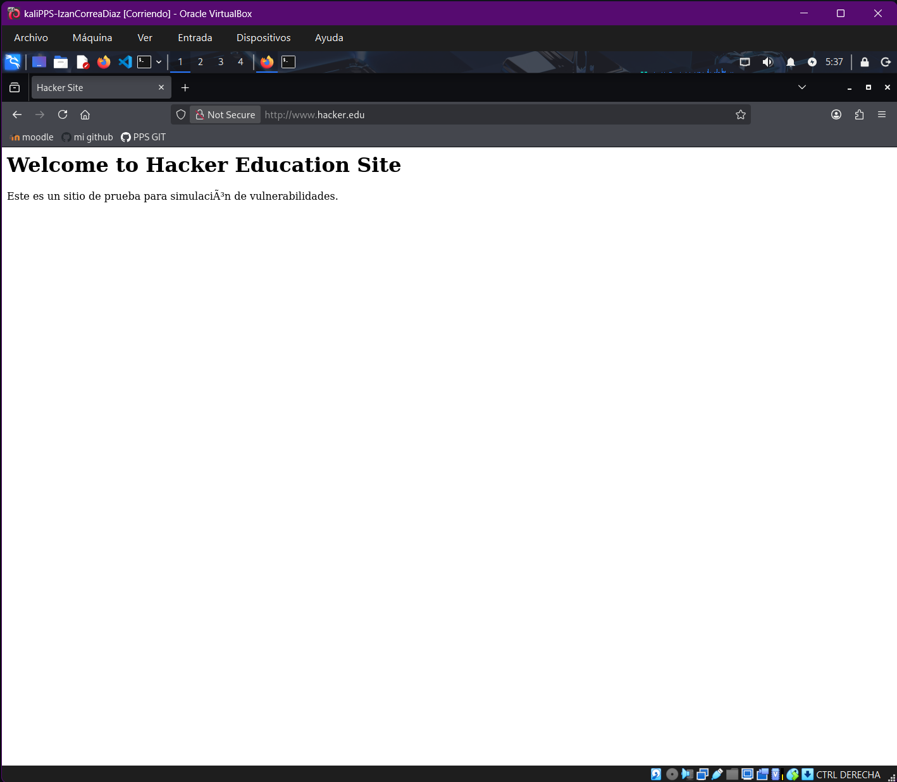

---

## 7. Habilitar HTTPS con SSL/TLS en Apache

Para proteger las comunicaciones, habilitamos HTTPS en nuestro servidor.

### Paso 1: Generar certificado SSL autofirmado

Entra en el contenedor:

```bash
docker exec -it lamp-php83 /bin/bash
```

Crea el directorio de certificados y genera uno autofirmado válido por 365 días:

```bash
mkdir -p /etc/apache2/ssl
cd /etc/apache2/ssl
openssl req -x509 -nodes -days 365 -newkey rsa:2048 -keyout localhost.key -out localhost.crt
```

**Parámetros del comando:**
- `-x509`: crea un certificado autofirmado en lugar de una CSR.
- `-nodes`: omite cifrar la clave privada (sin contraseña).
- `-newkey rsa:2048`: genera clave RSA de 2048 bits.
- `-keyout`: archivo de la clave privada.
- `-out`: archivo del certificado.
- `-days 365`: validez del certificado.

Durante la ejecución se te pedirá información (país, organización, nombre común, etc.). Puedes presionar Enter para dejar los valores por defecto, pero en **Common Name (CN)** pon el nombre de tu servidor:

```
Common Name (e.g. server FQDN or YOUR name): pps.edu
```

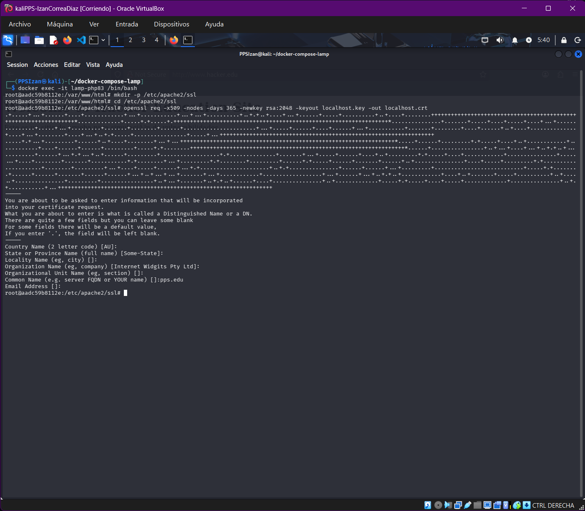

### Paso 2: Configurar Apache para usar HTTPS

Modifica el archivo de configuración de tu sitio virtual. En tu pila LAMP, este archivo está en `./config/vhosts/default.conf` (bind-mount).

Edita `./config/vhosts/default.conf` en tu anfitrón:

```conf
<VirtualHost *:80>
    ServerName www.pps.edu
    ServerAdmin webmaster@localhost
    DocumentRoot /var/www/html

    <Directory /var/www/html>
        Options Indexes FollowSymLinks
        AllowOverride None
        Require all granted
    </Directory>

    ErrorLog ${APACHE_LOG_DIR}/error.log
    CustomLog ${APACHE_LOG_DIR}/access.log combined
</VirtualHost>

<VirtualHost *:443>
    ServerName www.pps.edu

    SSLEngine on
    SSLCertificateFile /etc/apache2/ssl/localhost.crt
    SSLCertificateKeyFile /etc/apache2/ssl/localhost.key

    DocumentRoot /var/www/html
</VirtualHost>
```

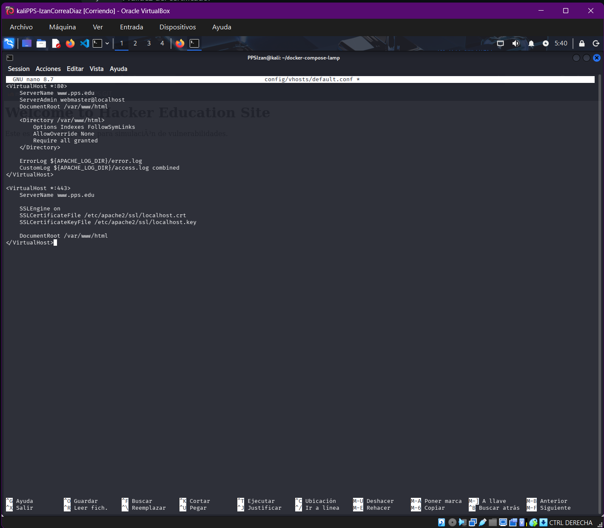

### Paso 3: Habilitar módulo SSL y recargar Apache

Desde el contenedor o anfitrón:

```bash
docker exec lamp-php83 /bin/bash -c "a2enmod ssl; service apache2 reload"
```

### Paso 4: Acceder por HTTPS

Ahora puedes acceder a:

```
https://www.pps.edu/
```

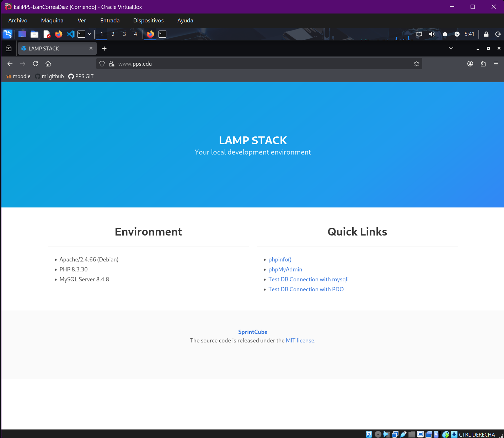

**Nota**: Como el certificado es autofirmado, el navegador avisará de que no es de confianza. Haz clic en "Avanzado" o "Continuar igualmente" para acceder al sitio.

---

## 8. Forzar HTTPS en Apache

Para forzar que todas las peticiones HTTP se redireccionen automáticamente a HTTPS, tienes dos opciones:

### Opción A: Redirect directo

Modifica `./config/vhosts/default.conf`:

```conf
<VirtualHost *:80>
    ServerName pps.edu
    ServerAlias www.pps.edu

    Redirect permanent / https://pps.edu/
</VirtualHost>

<VirtualHost *:443>
    ServerName pps.edu
    ServerAlias www.pps.edu
    DocumentRoot /var/www/html

    SSLEngine on
    SSLCertificateFile /etc/apache2/ssl/localhost.crt
    SSLCertificateKeyFile /etc/apache2/ssl/localhost.key
    SSLCertificateChainFile /etc/apache2/ssl/localhost.crt
</VirtualHost>
```

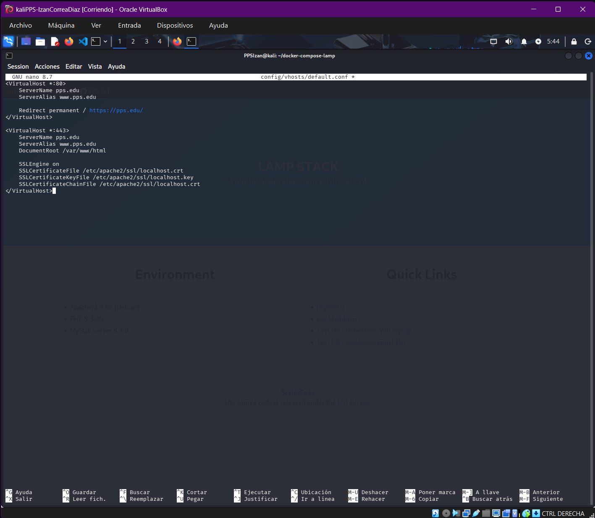

Recarga Apache:

```bash
docker exec lamp-php83 /bin/bash -c "service apache2 restart"
```

### Opción B: RewriteEngine (más flexible)

Modifica `./config/vhosts/default.conf`:

```conf
<VirtualHost *:80>
    ServerName www.pps.edu
    ServerAdmin webmaster@localhost
    DocumentRoot /var/www/html

    ErrorLog ${APACHE_LOG_DIR}/error.log
    CustomLog ${APACHE_LOG_DIR}/access.log combined

    RewriteEngine On
    RewriteCond %{HTTPS} off
    RewriteRule ^ https://%{HTTP_HOST}%{REQUEST_URI} [L,R=301]
</VirtualHost>

<VirtualHost *:443>
    ServerName www.pps.edu

    SSLEngine on
    SSLCertificateFile /etc/apache2/ssl/localhost.crt
    SSLCertificateKeyFile /etc/apache2/ssl/localhost.key

    DocumentRoot /var/www/html
</VirtualHost>
```

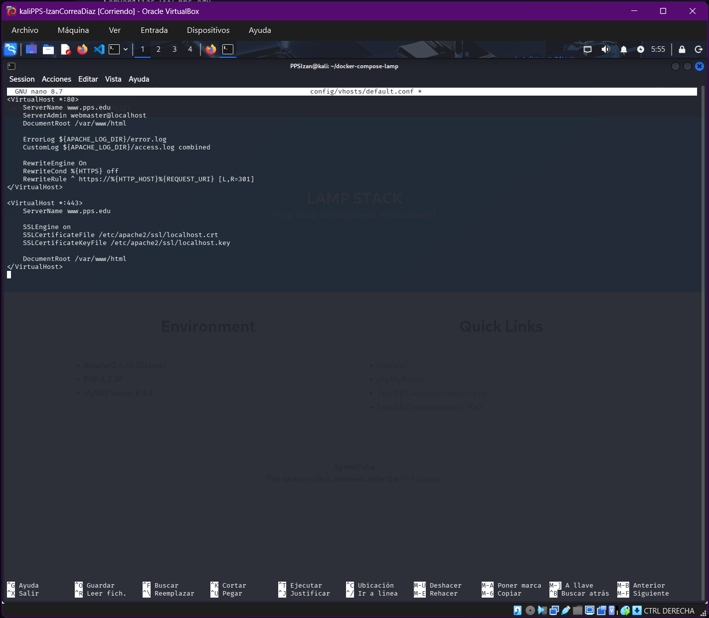

Asegúrate de que el módulo `mod_rewrite` está habilitado:

```bash
docker exec lamp-php83 /bin/bash -c "a2enmod rewrite; service apache2 restart"
```

---

## 9. Alternativa: Forzar HTTPS con `.htaccess`

Si prefieres no modificar la configuración global de Apache, puedes usar un archivo `.htaccess` en la raiz del proyecto (`./www/.htaccess`):

```apache
RewriteEngine On

# Si no está usando HTTPS
RewriteCond %{HTTPS} !=on
RewriteRule ^ https://%{HTTP_HOST}%{REQUEST_URI} [L,R=301]
```

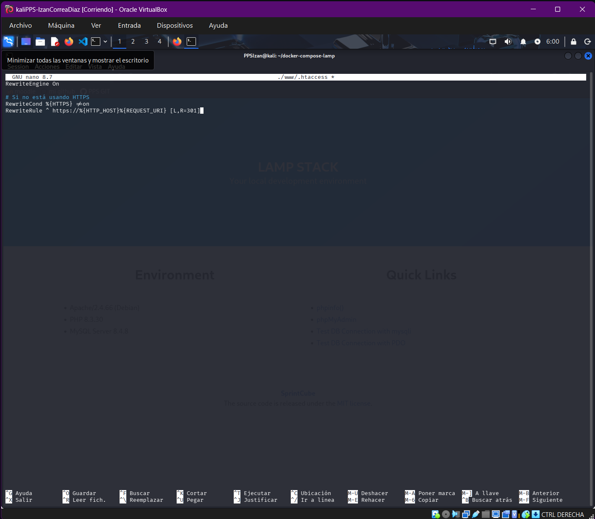

**Requisito**: En tu `./config/vhosts/default.conf` debes permitir que se lean archivos `.htaccess`:

```conf
<VirtualHost *:80>
    ServerName www.pps.edu

    <Directory /var/www/html>
        AllowOverride All
    </Directory>

    ServerAdmin webmaster@localhost
    DocumentRoot /var/www/html

    ErrorLog ${APACHE_LOG_DIR}/error.log
    CustomLog ${APACHE_LOG_DIR}/access.log combined
</VirtualHost>

<VirtualHost *:443>
    ServerName www.pps.edu

    SSLEngine on
    SSLCertificateFile /etc/apache2/ssl/localhost.crt
    SSLCertificateKeyFile /etc/apache2/ssl/localhost.key

    DocumentRoot /var/www/html
</VirtualHost>
```

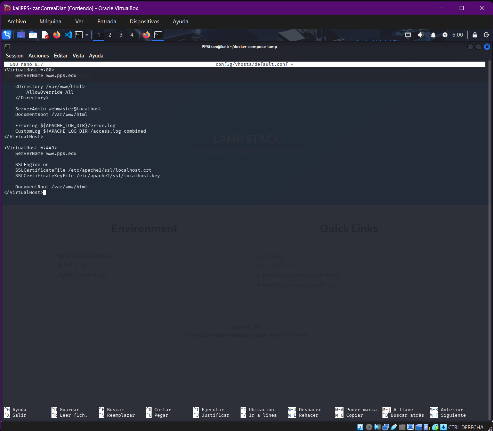

Asegúrate de que `mod_rewrite` está habilitado:

```bash
docker exec lamp-php83 /bin/bash -c "a2enmod rewrite; service apache2 restart"
```

---

## 10. Implementación y Evaluación de Content Security Policy (CSP)

Para reforzar la seguridad, implementamos una política de seguridad de contenidos (**CSP**). El CSP ayuda a prevenir ataques como XSS al restringir de dónde se pueden cargar scripts, estilos e imágenes.

### Configuración en `default.conf`

Edita `./config/vhosts/default.conf` y añade:

```conf
<IfModule mod_headers.c>
    Header always set Content-Security-Policy "default-src 'self'; script-src 'self' object-src 'none'; base-uri 'self'; frame-ancestors 'none'"
</IfModule>
```

Con esta política, solo se permite cargar contenido de tu propio servidor (`'self'`), bloqueando cualquier fuente externa.

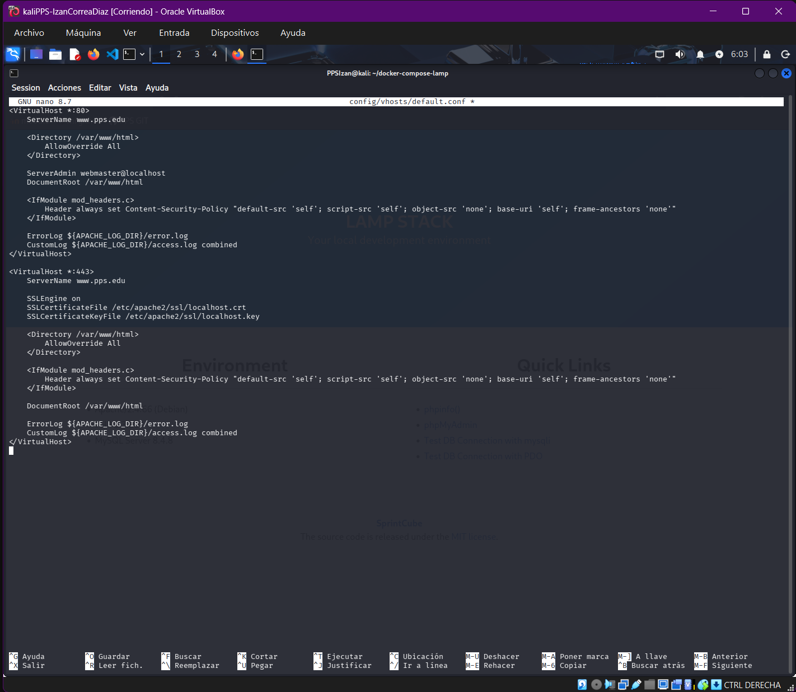

---

## 11. HSTS (HTTP Strict Transport Security)

HSTS obliga al navegador a usar siempre HTTPS, evitando ataques de tipo *downgrade*.

### Configuración en `default.conf`

Añade la siguiente cabecera en tu VirtualHost HTTPS (puerto 443):

```conf
Header always set Strict-Transport-Security "max-age=63072000; includeSubDomains; preload"
```

**Importante**: Asegúrate de que HTTPS funcione correctamente antes de aplicar HSTS, ya que los navegadores recordarán esta configuración por mucho tiempo (2 años en este ejemplo).

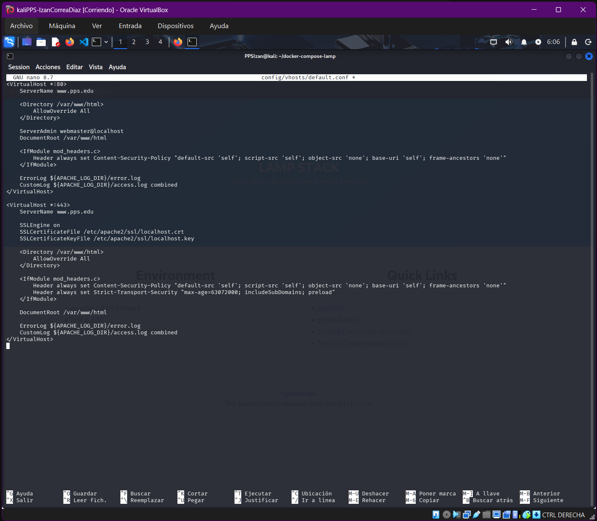

---

## 12. Identificación y Corrección de Security Misconfiguration

La **Security Misconfiguration** (configuración de seguridad incorrecta) ocurre cuando los servicios tienen configuraciones por defecto inseguras o exponen información sensible.

### 12.1 Ocultar información del servidor (Apache)

Por defecto, Apache puede mostrar su versión y sistema operativo en las cabeceras. Compruébalo con:

```bash
curl -I http://pps.edu
```

Si ves algo como `Server: Apache/2.4.41 (Ubuntu)`, estás exponiendo información.

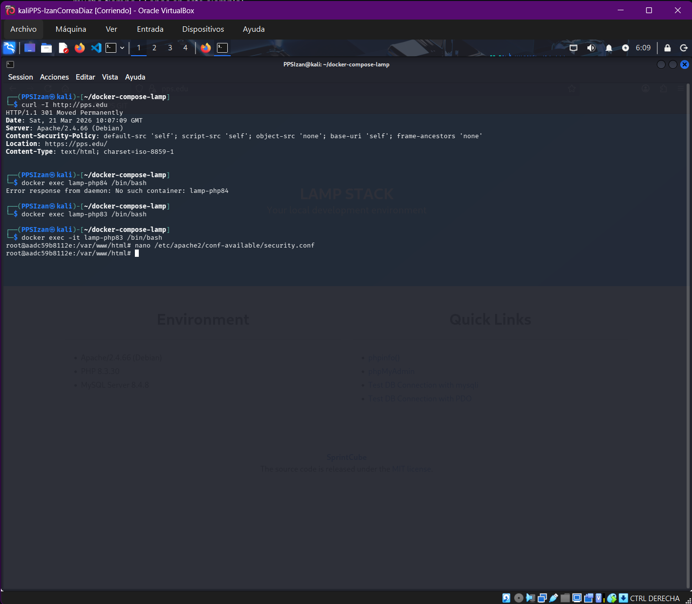

**Corrección:**
Modifica `/etc/apache2/conf-available/security.conf` (dentro del contenedor):

```conf
ServerSignature Off
ServerTokens Prod
```

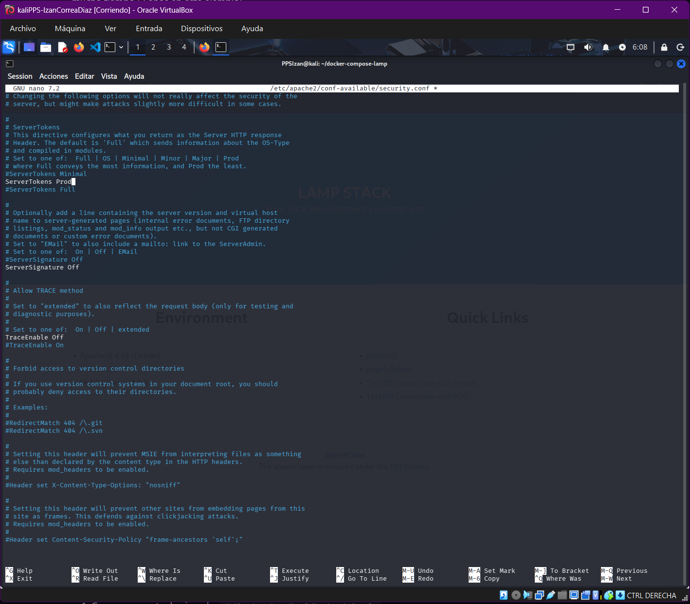

Reinicia Apache:
```bash
docker exec lamp-php83 /bin/bash -c "service apache2 reload"
```

### 12.2 Ocultar versión de PHP

PHP también expone su versión a través de la cabecera `X-Powered-By`.

**Corrección:**
Edita tu archivo `php.ini` (en `./config/php/php.ini` o `/usr/local/etc/php/php.ini`):

```ini
expose_php = Off
```

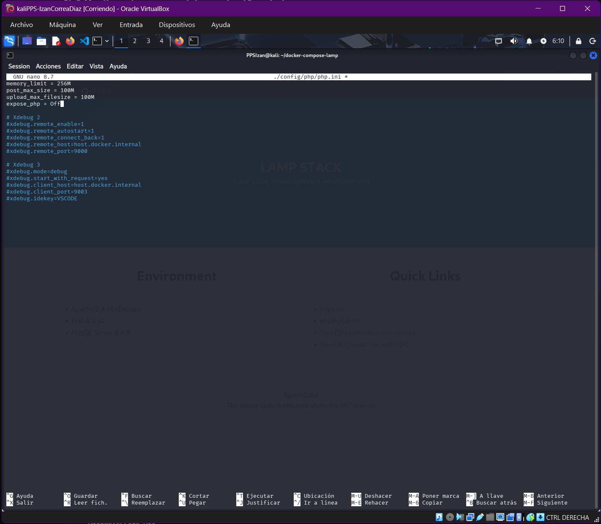

Recarga Apache y verifica de nuevo con `curl -I`.

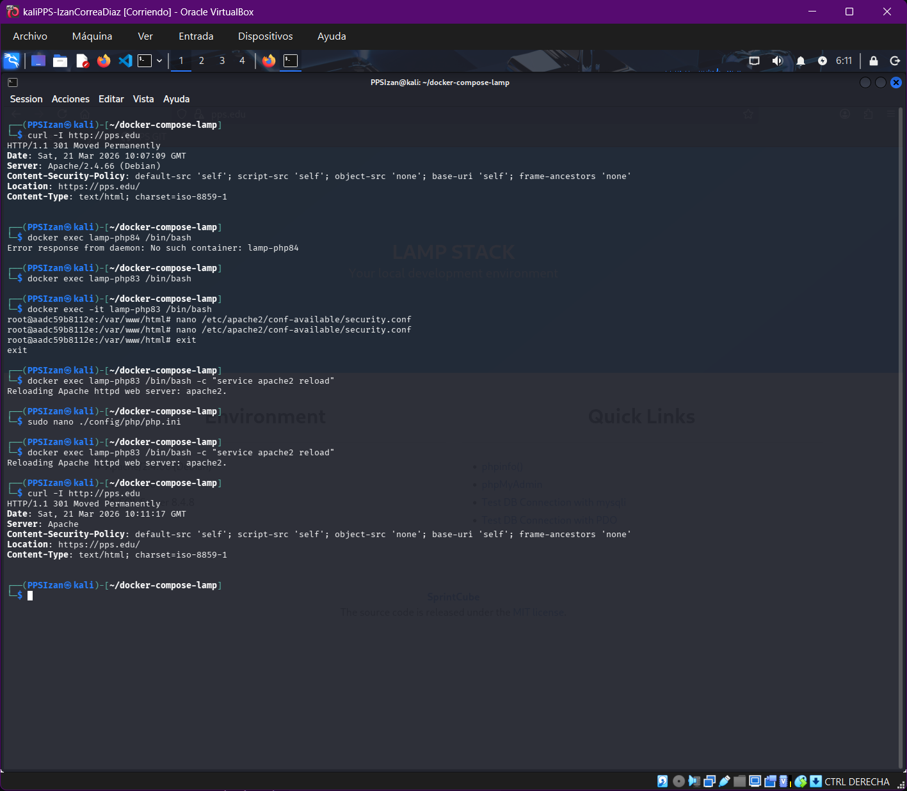

### 12.3 Deshabilitar listado de directorios

Si no hay un archivo `index.html` o `index.php`, Apache muestra el listado de archivos del directorio por defecto.

**Prueba:**
1. Crea una carpeta de ejemplo: `mkdir /var/www/html/hacker/ejemplo`
2. Añade archivos: `touch /var/www/html/hacker/ejemplo/file1.txt`
3. Accede a `http://hacker.edu/ejemplo/`. Si ves los archivos, hay un fallo de configuración.

**Corrección:**
En la configuración de tu sitio (`default.conf` o `hacker.conf`), cambia `Indexes` por `-Indexes`:

```conf
<Directory /var/www/html/hacker>
    Options -Indexes +FollowSymLinks
    AllowOverride All
    Require all granted
</Directory>
```

---

## 13. Otras Mitigaciones y Mejores Prácticas

### 13.1 Revisar permisos de archivos sensibles

Los archivos de configuración no deben ser legibles por usuarios no autorizados:
```bash
chmod 640 /etc/apache2/apache2.conf
```

### 13.2 Políticas de Control de Acceso (Autorización)

Usa la directiva `Require` para limitar accesos:
- `Require all granted`: Acceso total.
- `Require all denied`: Bloqueo total.
- `Require local`: Solo desde localhost.
- `Require ip 172.20`: Solo desde una red específica.

### 13.3 Desactivar métodos HTTP inseguros

Limita los métodos permitidos a los necesarios (normalmente GET y POST):

```conf
<Directory />
    <LimitExcept GET POST>
        Deny from all
    </LimitExcept>
</Directory>
```

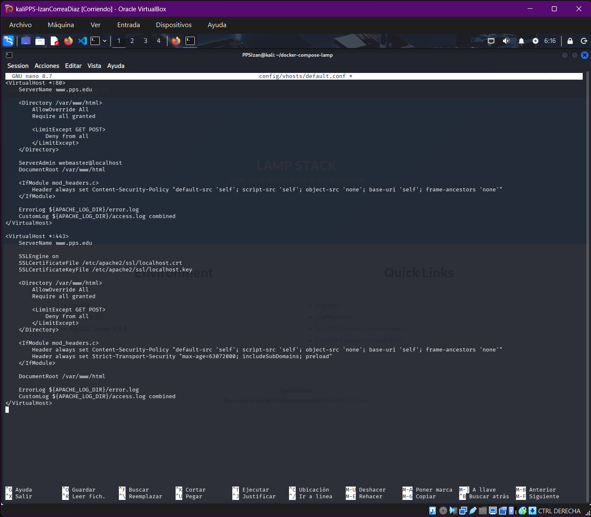

---

## 14. Implementación de WAF con ModSecurity

Un **WAF (Web Application Firewall)** protege contra ataques comunes como SQLi, XSS y Path Traversal filtrando el tráfico malicioso.

### Paso 1: Instalar ModSecurity

Entra en el contenedor y ejecuta:
```bash
apt update
apt install libapache2-mod-security2
```

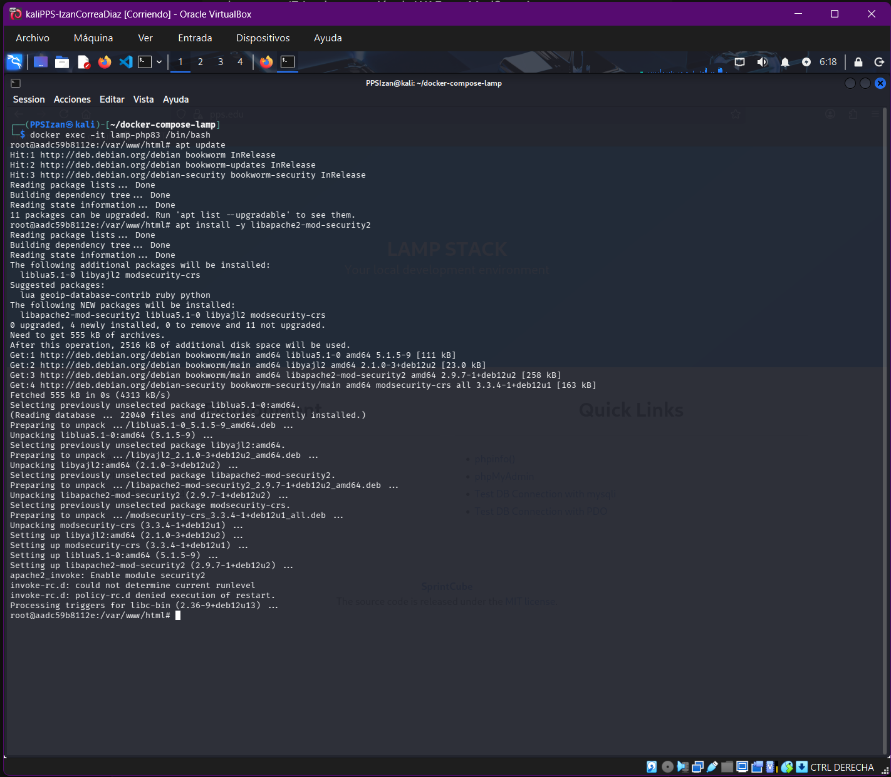

### Paso 2: Configuración recomendada

```bash
cp /etc/modsecurity/modsecurity.conf-recommended /etc/modsecurity/modsecurity.conf
```

Edita `/etc/modsecurity/modsecurity.conf` y cambia:
- `SecRuleEngine DetectionOnly` (para solo loguear ataques).
- `SecRuleEngine On` (para bloquear ataques activamente).

### Paso 3: Instalar reglas OWASP CRS

```bash
cd /etc/modsecurity
git clone https://github.com/coreruleset/coreruleset.git
cd coreruleset
cp crs-setup.conf.example crs-setup.conf
```

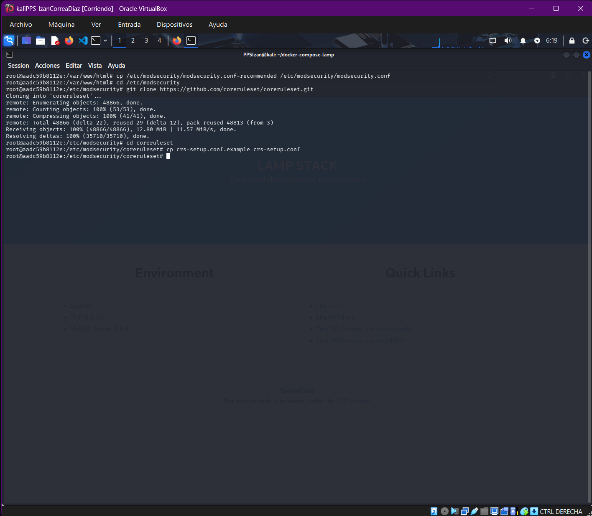

Asegúrate de que las reglas se carguen en `/etc/apache2/mods-available/security2.conf` o crea un archivo en `conf-available`:

```conf
IncludeOptional /etc/modsecurity/coreruleset/crs-setup.conf
IncludeOptional /etc/modsecurity/coreruleset/rules/*.conf
```

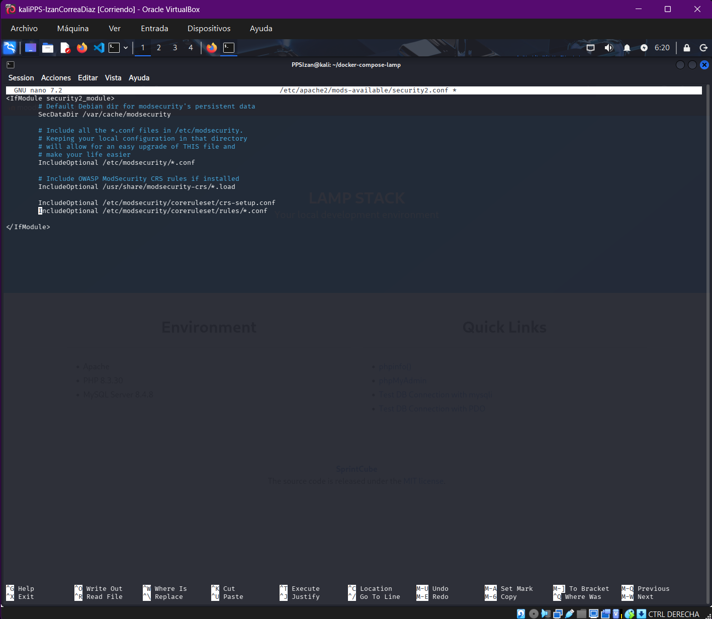

### Paso 4: Probar el WAF

Intenta un ataque de **Path Traversal**:
`https://pps.edu/lfi.php?file=../../../../etc/passwd`

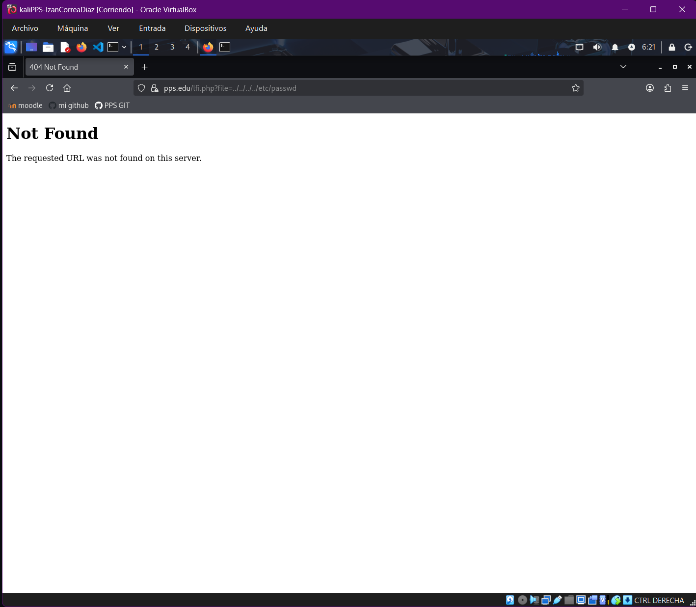

---

## 15. Solución de Problemas (Troubleshooting)

### Escenario no arranca tras cambios
Si Apache falla al iniciar después de modificar vhosts, puede ser porque:
- Falta un módulo (ej: `ssl`, `headers`, `rewrite`). Habilítalos con `a2enmod`.
- Hay un error de sintaxis en el `.conf`. Revisa con `apache2ctl -t`.

### Persistencia de datos en Docker
- Los cambios en volúmenes bind-mount (`./config`, `./www`) persisten tras un `docker-compose down`.
- Si necesitas empezar de cero totalmente: `docker-compose down -v` y borra manualmente las carpetas de configuración si es necesario.

---

## 16. GUARDANDO LOS CAMBIOS

Para guardar los cambios y volver a dejar la configuración original pasamos los dos scripts.

```bash
sudo ./guardarConfiguraciones.sh ApacheSeguro
sudo ./restaurarConfiguracionOriginal.sh
```

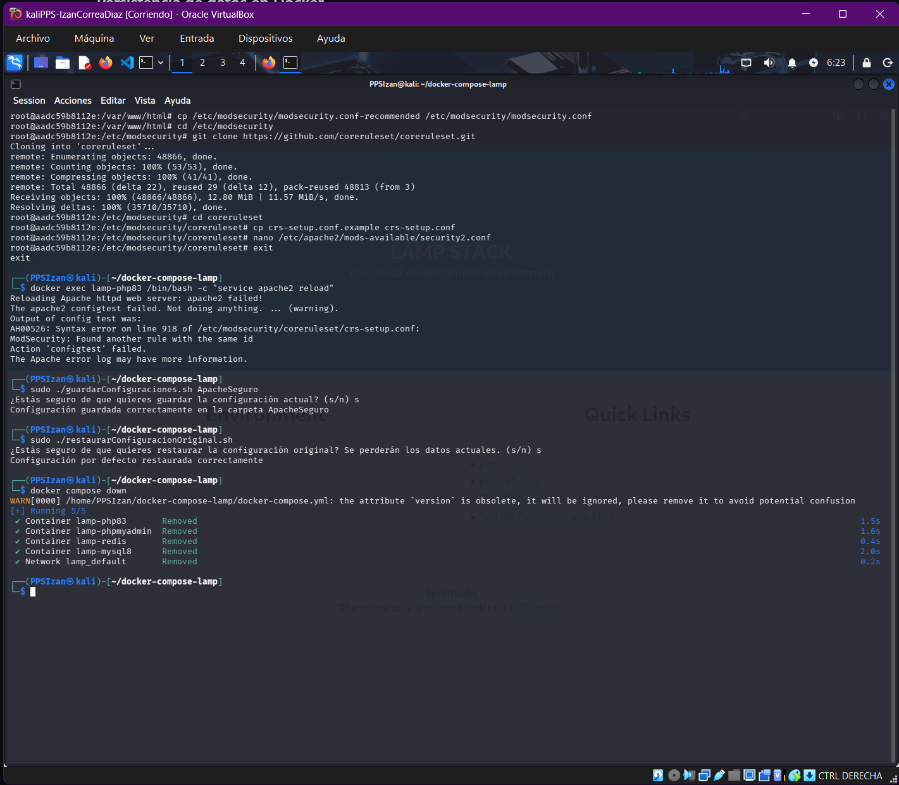

Los archivos que hemos creado se guardarán en la carpeta `./ApacheSeguro/www`. Aunque en esta ocasión como hemos trabajado sobre todo con archivos de configuración, algunos de ellos no se han guardado.

Si no vas a seguir trabajando con el entorno de pruebas, puedes parar el escenario:

```bash
docker compose down
```
